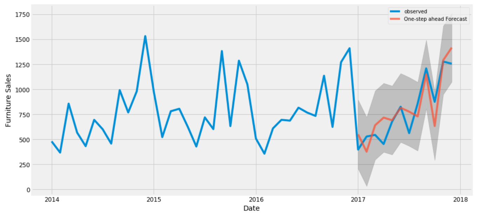

# Estudio de las principales herramientas para el estudio de series de tiempo
Exploración y modelamiento de series de tiempo en Python. La principal guía del proyecto será el API Reference de la librería `statsmodels`: https://www.statsmodels.org/stable/api.html

  

El estudio de series de tiempo se divide por lo siguiente:
1. Series estacionarias
2. Series no estacionarias: raíz unitaria
3. Modelos multivariados: VAR y SVAR con sus IRFs y FEVDs.
4. Cointegración
5. Filtros: HP, BK, CF, entre otros
6. Modelos de volatilidad: ARCH y GARCH

Se usará las librerías `statsmodels` y `arch`.
